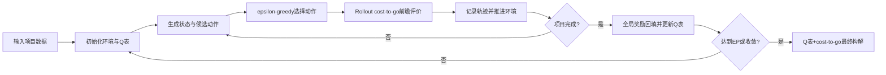

# 面向多里程碑多技能可中断项目调度的 Rollout-Q-learning 算法

## 摘要

多技能项目调度问题广泛存在于 IT 项目服务、咨询实施和工程交付等场景中。此类项目通常包含任务前后约束、人员技能差异、任务可中断恢复以及多个里程碑交付节点。若里程碑节点延迟完成，将产生相应的加权延迟惩罚。传统启发式调度规则具有计算速度快、实现简单等优点，但难以从历史决策中学习状态到动作的长期价值；普通 Q-learning 虽具有学习能力，但在调度问题中容易受到稀疏奖励和大动作空间影响，导致策略质量不稳定。为此，本文提出一种面向解质量的 Rollout-Q-learning 动态调度算法。该算法采用六维离散状态表示当前调度压力，以完整动作三元组刻画任务、人员和执行方式，并将 Rollout cost-to-go 前瞻评价引入 Q-learning 的训练与最终构解过程。基于 J10、J20、J30 和 J60 四类案例的计算实验表明，所提出的 RQL 方法在平均总延迟惩罚和相对偏差指标上均优于启发式规则、纯 Rollout 启发式方法和普通 Q-learning 方法，但需要承担更高的计算时间成本。实验结果说明，Rollout 前瞻信息能够有效增强 Q-learning 在多技能可中断项目调度中的动作价值判断能力。

**关键词**：项目调度；多技能资源；任务可中断；里程碑；Rollout；Q-learning

## 1 引言

项目型服务是 IT 服务中的重要组织形式。与标准流水线生产调度不同，项目型服务通常由多个具有前后续关系的任务组成，并依赖具备不同技能水平的服务人员完成。实际项目执行过程中，服务人员可能因资源冲突或更紧迫任务而发生重新分配，正在执行的任务也可能被中断并在后续恢复。同时，项目合同或管理计划中通常设置若干里程碑节点，用以约束阶段性交付时间。若里程碑发生延迟，项目将面临进度、质量和成本方面的损失。

上述特征使多技能可中断项目调度问题具有明显的动态性和组合复杂性。一方面，任务执行顺序需要满足网络前序约束；另一方面，服务人员与任务之间存在技能匹配和处理时间差异。若仅依赖固定优先规则，算法难以根据不同状态下的资源紧张程度和里程碑压力调整决策。若直接采用普通 Q-learning，由于调度过程的奖励信号通常在项目结束后才充分体现，且候选动作由任务、人员和执行方式共同决定，训练过程容易出现动作价值区分不足和策略不稳定。

为解决上述问题，本文提出一种 Rollout-Q-learning 算法，简称 RQL。该方法的核心思想是将 Rollout 的前瞻评价能力与 Q-learning 的策略学习能力结合起来。在训练阶段，算法通过 episode 采样记录状态转移轨迹，并将局部执行反馈、cost-to-go 前瞻收益和最终总延迟惩罚共同用于 Q 表更新；在最终构解阶段，算法以训练后的 Q 表作为主要决策依据，并在 Q 值区分不明显时引入 cost-to-go 或 beam search 辅助判别。本文的主要贡献如下。

1. 构建了面向多技能人员、任务可中断和多里程碑延迟惩罚的动态调度决策框架。
2. 提出将 Rollout cost-to-go 前瞻评价嵌入 Q-learning 训练和构解过程的 RQL 方法。
3. 设计六维离散状态表示 `(NLF, SBI, MUR, RUR, CRT, ITN)` 和完整动作三元组 `(action_type, task_id, person_id)`，增强动作价值区分能力。
4. 在 J10、J20、J30 和 J60 案例上进行对比实验，验证 RQL 在解质量指标上的优势，并分析其计算时间成本。

## 2 问题描述

考虑一个由 `n` 个任务节点组成的项目网络，其中包含虚拟起点和虚拟终点。任务之间存在前后续约束，只有当某任务的所有紧前任务完成后，该任务才可被执行。项目由若干名服务人员完成，每名服务人员具有特定技能集合。对于同一任务，不同人员的处理时间可以不同；若某人员不具备任务所需技能，则该人员不能执行该任务。

项目执行过程中，任务允许被中断。若某项任务被中断，则需要记录其剩余处理时间，并在后续由原执行人员恢复执行。任一服务人员在同一时刻最多执行一项任务。项目中预设多个里程碑事件，每个里程碑具有计划完成时间和惩罚权重。若里程碑的实际完成时间晚于计划完成时间，则产生加权延迟惩罚。本文优化目标为最小化全部里程碑事件的总延迟惩罚：

```text
min C = Σ_{m∈M} w_m · max(0, F_m - D_m)
```

其中，`M` 表示里程碑集合，`w_m` 表示里程碑 `m` 的惩罚权重，`F_m` 表示实际完成时间，`D_m` 表示计划完成时间。该目标直接反映项目阶段性交付违约损失，适合刻画多里程碑项目服务场景下的调度质量。

## 3 Rollout-Q-learning 算法

### 3.1 算法总体框架

RQL 算法由训练阶段和最终构解阶段组成。训练阶段从初始环境开始进行多轮 episode 采样，每个决策时刻首先生成可行动作集合，然后基于 epsilon-greedy 策略选择动作集合并执行。执行过程中记录状态、动作、局部奖励和下一状态。当 episode 结束后，算法计算项目总延迟惩罚，并将全局奖励回填到轨迹中的各个动作，用于统一更新 Q 表。最终构解阶段则基于训练后的 Q 表逐步生成调度方案。



图1展示了 RQL 的基本流程。与普通 Q-learning 相比，RQL 的关键差异在于引入了 Rollout cost-to-go 评价，使算法在训练时能够感知当前动作对后续里程碑延迟惩罚的影响。

### 3.2 状态表示

由于完整项目状态包含任务状态、人员占用、剩余工期和中断信息，若直接作为 Q 表索引将导致状态空间过大。本文采用六维离散状态表示：

```text
s = (NLF, SBI, MUR, RUR, CRT, ITN)
```

其中，`NLF` 表示网络层级特征，用于描述当前已完成任务在项目网络中的推进程度；`SBI` 表示技能瓶颈指数，用于反映当前可执行任务中人员匹配的紧张程度；`MUR` 表示里程碑紧迫度，用于刻画未完成里程碑的时间压力；`RUR` 表示资源利用率；`CRT` 表示关键运行任务压力；`ITN` 表示当前中断任务数量。上述特征共同描述项目进度、资源状态和里程碑风险，使 Q 表能够在较低维度下捕捉关键调度信息。

### 3.3 动作空间

本文将学习动作定义为完整动作三元组：

```text
a = (action_type, task_id, person_id)
```

其中，`action_type` 包括 `assign`、`resume` 和 `continue`。`assign` 表示将某名人员分配给一个可执行新任务，`resume` 表示由原人员恢复中断任务，`continue` 表示当前正在执行的任务继续运行。中断动作不作为独立学习动作；当选择 `assign` 或 `resume` 时若目标人员正在执行其他任务，系统自动插入必要的中断动作。完整动作表示能够区分不同任务、不同人员和不同执行方式，避免将所有分配动作压缩为同一类动作所导致的价值混淆。

### 3.4 奖励函数与 Q 表更新

训练过程中，局部奖励由即时执行反馈和 cost-to-go 前瞻收益共同组成。即时执行反馈用于鼓励成功分配、恢复或继续执行任务，并对中断行为施加一定惩罚；前瞻收益则通过比较当前动作集合和基准启发式动作集合的后续总延迟惩罚获得。episode 结束后，算法根据项目总延迟惩罚计算全局奖励：

```text
r_global = -C
```

最终用于 Q 表更新的综合奖励为：

```text
r_update = λ_l · r_local + λ_g · r_global
```

其中，`λ_l` 和 `λ_g` 分别表示局部奖励与全局奖励的权重。Q 表采用标准一阶更新形式：

```text
Q(s,a) ← Q(s,a) + α [r_update + γ max_a' Q(s',a') - Q(s,a)]
```

这种设计使算法既能利用局部动作反馈，又能保持与最终总延迟惩罚目标一致。

### 3.5 Cost-to-go 与最终构解

cost-to-go 是 RQL 中连接启发式前瞻和 Q-learning 的关键机制。对于某一候选动作集合，算法先在当前环境副本中执行该动作集合，再使用启发式规则补全后续调度过程，最终得到该动作集合对应的总延迟惩罚估计。本文使用 MPV、SLK 和 EFT 等规则构造后续启发式调度，其中 MPV 强调里程碑前序任务优先，SLK 强调任务时差紧迫性，EFT 用于为任务选择预计完成时间最早的可行人员。

在最终构解阶段，算法优先依据 Q 表选择动作。当候选动作的 Q 值差异不足以形成明确判断时，使用 cost-to-go 作为补充判据；对于多个可兼容动作，还通过 beam search 保留有限数量的候选动作集，以在解质量和运行时间之间取得折中。

## 4 计算实验设计

本文实验案例基于 MRCPSPLIB 和 RCPSPLIB 的项目网络结构生成。实验选取 J10、J20、J30 和 J60 四个任务规模作为主结果，其中 J10、J20 和 J30 每个规模选取 100 个案例，J60 选取 20 个案例。规模 `J` 表示真实任务数量，案例文件中还包含虚拟起点和虚拟终点，因此总节点数为 `J+2`。随机算法每个案例运行 3 个 seed，确定性启发式方法运行一次。

对比方法包括五类代表性方法：`MXS+MF`、`MPV-SLK-EFT`、普通 `QL`、纯 Rollout 启发式方法 `RH`，以及本文提出的 `RQL`。评价指标包括平均总延迟惩罚 `AOTV`、标准差 `Std`、相对百分比偏差 `ARPD` 和平均运行时间 `Time`。其中 AOTV、Std 和 ARPD 越小表示解质量或稳定性越好；Time 用于评价计算开销。

## 5 结果与讨论

表1给出了 J10、J20、J30 和 J60 上的主实验结果。

**表1 J10-J60 主实验结果**

| 规模 | 方法 | AOTV | Std | ARPD(%) | Time(s) |
|---|---:|---:|---:|---:|---:|
| J10 | RQL | 1.301 | 1.272 | 8.15 | 6.579 |
| J10 | RH | 1.457 | 1.361 | 23.09 | 0.083 |
| J10 | MXS+MF | 2.284 | 1.973 | 87.60 | 0.001 |
| J10 | MPV-SLK-EFT | 2.202 | 2.072 | 76.00 | 0.001 |
| J10 | QL | 1.992 | 1.733 | 56.63 | 7.534 |
| J20 | RQL | 2.277 | 1.822 | 25.42 | 41.175 |
| J20 | RH | 2.722 | 2.266 | 51.44 | 0.397 |
| J20 | MXS+MF | 3.332 | 2.500 | 90.25 | 0.003 |
| J20 | MPV-SLK-EFT | 3.833 | 3.173 | 120.48 | 0.003 |
| J20 | QL | 5.143 | 4.018 | 202.37 | 17.195 |
| J30 | RQL | 2.473 | 2.265 | 25.32 | 178.812 |
| J30 | RH | 2.677 | 2.416 | 38.52 | 1.058 |
| J30 | MXS+MF | 3.587 | 3.375 | 77.93 | 0.004 |
| J30 | MPV-SLK-EFT | 3.833 | 3.522 | 93.91 | 0.004 |
| J30 | QL | 13.229 | 7.375 | 679.08 | 27.770 |
| J60 | RQL | 9.260 | 4.338 | 22.74 | 724.079 |
| J60 | RH | 10.355 | 4.283 | 40.22 | 13.839 |
| J60 | MXS+MF | 11.785 | 4.429 | 68.33 | 0.016 |
| J60 | MPV-SLK-EFT | 15.025 | 7.068 | 104.89 | 0.015 |
| J60 | QL | 55.748 | 13.598 | 728.44 | 58.682 |

从 AOTV 结果看，RQL 在四个主实验规模上均取得最低平均总延迟惩罚。相对于 RH，RQL 在 J10、J20、J30 和 J60 上分别降低约 10.7%、16.4%、7.6% 和 10.6%。这一结果说明，在纯 Rollout 启发式基础上引入 Q 表学习能够进一步改善动作选择质量。与确定性启发式方法相比，RQL 的优势更加明显，说明固定规则难以适应不同状态下的资源压力与里程碑风险。

普通 Q-learning 在 J20、J30 和 J60 上表现明显较差，尤其 J30 和 J60 的 AOTV 与 ARPD 均显著高于其他方法。这说明在该类调度问题中，仅依赖 Q-learning 自身的探索与最终奖励信号难以形成稳定有效的策略。RQL 的优势正来自于 Rollout cost-to-go 对后续调度代价的前瞻估计，它能够为 Q-learning 提供更贴近最终目标的局部学习信号。

从稳定性看，RQL 在 J10、J20、J30 和 J60 上的 ARPD 均低于其他方法，说明其结果更接近同一案例下的已知最好解。Std 指标方面，RQL 在 J10、J20 和 J30 上也保持较低水平；J60 中 RQL 的 Std 与 RH 接近，说明规模增大后不同案例间的波动仍然存在。

从计算时间看，RQL 明显慢于确定性启发式和 RH。该现象与算法机制一致：RQL 在训练阶段和构解阶段均调用 cost-to-go 前瞻仿真，而前瞻仿真需要对后续调度过程进行补全估计，因此计算成本随任务规模快速上升。由此可见，RQL 更适合作为解质量优先的调度方法，而不是追求极低运行时间的快速启发式方法。对于更大规模问题，后续需要进一步优化 cost-to-go 缓存、候选动作剪枝和训练预算控制。

此外，J90 和 J120 的补充结果显示，RQL 仍能取得较低 AOTV，但运行时间进一步上升。因此，本文将 J10-J60 作为主实验范围，并将更大规模实验作为算法可扩展性和计算代价之间权衡的后续研究方向。

## 6 结论

本文针对考虑多里程碑、多技能人员和任务可中断的项目调度问题，提出了一种 Rollout-Q-learning 动态调度算法。该算法使用六维离散状态描述项目进度、资源压力和里程碑风险，以完整动作三元组表示任务、人员和执行方式，并将 Rollout cost-to-go 前瞻评价引入 Q-learning 训练与最终构解过程。

基于 J10、J20、J30 和 J60 案例的实验结果表明，RQL 在 AOTV 和 ARPD 指标上均优于 RH、普通 Q-learning 和多种启发式规则，说明 Rollout 前瞻信息能够有效改善 Q-learning 在调度场景中的动作价值判断。然而，RQL 的时间成本显著高于启发式方法，尤其在规模增大时更为明显。未来工作将重点从三个方向改进：第一，进一步提升 cost-to-go 缓存效率；第二，设计更强的候选动作剪枝策略；第三，研究面向大规模案例的训练预算和状态聚合方法。

## 参考文献建议

会议短文正式投稿前建议补充以下方向的参考文献，并按目标会议模板统一格式：

1. 资源受限项目调度问题（RCPSP）及其多模式、多技能扩展综述。
2. PSPLIB、MRCPSPLIB 或 RCPSPLIB 案例库相关文献。
3. Q-learning 基础文献及其在调度问题中的应用。
4. Rollout algorithm、approximate dynamic programming 与启发式前瞻搜索相关文献。
5. 多里程碑项目调度、任务可中断调度和服务人员调度相关研究。

